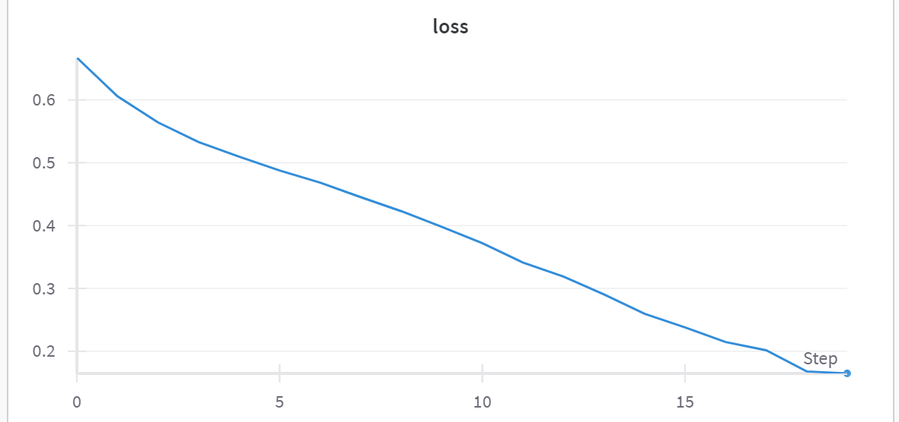

# Convolutional neural network, that choose between dog and cat
***
## - How to launch it?
## - Watch main.py, everything is described in main.py
***
## Stats:
### Architecture: LeNet
### Train set size: 24000 images
### Test set size: 1000 images
### Accuracy: 73.5
### Number of learned epochs: 20

