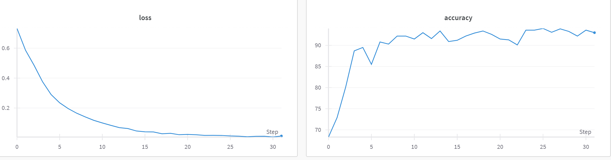

# Convolutional neural network, that choose between dog and cat
***
# Train it to use!
***
## - How to launch it?
- Watch main.py, everything is described in main.py
***
## Stats:
### Architecture: AlexNet
### Train set size: 24000 images
### Test set size: 1000 images
### Accuracy: 93.9
### Training 1: Number of learned epochs: 32

